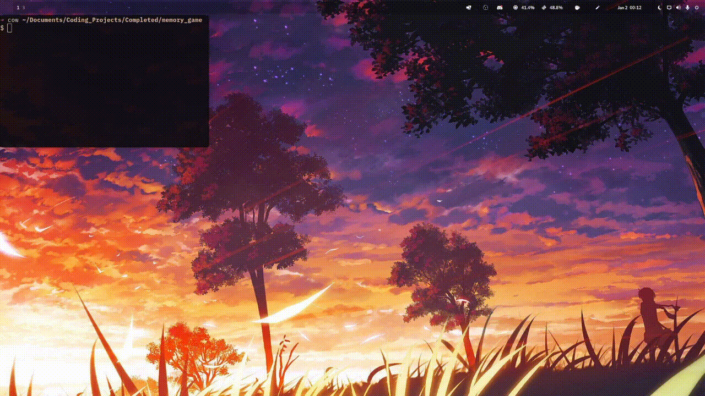

<h1 align='center'>Memory Game</h1>

<h4 align='center'>An old school memory game built with Pygame</h4>

<br>



- [Live](youtube video) demonstration video.
- [Demo](https://replit.com/@KingCao/Memory-Game?v=1) the Project.


<!-- ABOUT THE PROJECT -->
## About The Project

This project was created during an optional computer science course I took. We were learning Pygame and one of the final projects was to make a memory game. This was what I created!

Also, how else would I improve my memory skills? I play this game once a day and now I'm super smart.

### Built With

Python3.
Pygame.

<!-- GETTING STARTED -->
## Getting Started

The following instructions will help you get set up locally. Don't hesitate to message me if you have any problems!

### Prerequisites

- [python 3](https://www.python.org/downloads/)
- The [python installer package installer](https://pip.pypa.io/en/stable/installation/): `pip` (used to install required dependencies)
```sh
python -m ensurepip --upgrade
```

### Installation

1. Clone the repo
```sh
git clone git@github.com:dave-cao/Pomodoro-Cli.git
```
3. Install pip packages
```sh
pip install -r requirements.txt
```

<!-- USAGE EXAMPLES -->
## Usage

Example images can also go here...

1. Go into the `config.py` file and configure the settings to your liking. The default is a 50 minute pomodoro with 10 minute short breaks and a 30 minute long break. File paths can also be configured here.


2. Run the application
```sh
python3 main.py
```


3. Exit application
```
ctl + c
```

_For a more comprehensive example of using this application, refer to this [video](example video here)_


<!-- ROADMAP -->
## Roadmap

Future plans...


<!-- CONTRIBUTING -->
## Contributing

Contributions are what make the open source community such an amazing place to learn, inspire, and create. Any contributions you make are **greatly appreciated**.

If you have a suggestion that would make this better, please fork the repo and create a pull request. You can also simply open an issue with the tag "enhancement".
Don't forget to give the project a star! Thanks again!

1. Fork the Project
2. Create your Feature Branch (`git checkout -b feature/AmazingFeature`)
3. Commit your Changes (`git commit -m 'Add some AmazingFeature'`)
4. Push to the Branch (`git push origin feature/AmazingFeature`)
5. Open a Pull Request


<!-- CONTACT -->
## Contact

#### David Cao
- Email: sirdavidcao@gmail.com
- [Youtube](https://www.youtube.com/channel/UCEnBPbnNnqhQIIhW1uLXrLA)
- [Linkedin](https://www.linkedin.com/in/david-cao99/)
- Personal Website: https://davidcao.xyz/
- Project Link - https://github.com/dave-cao/Pomodoro-Cli


